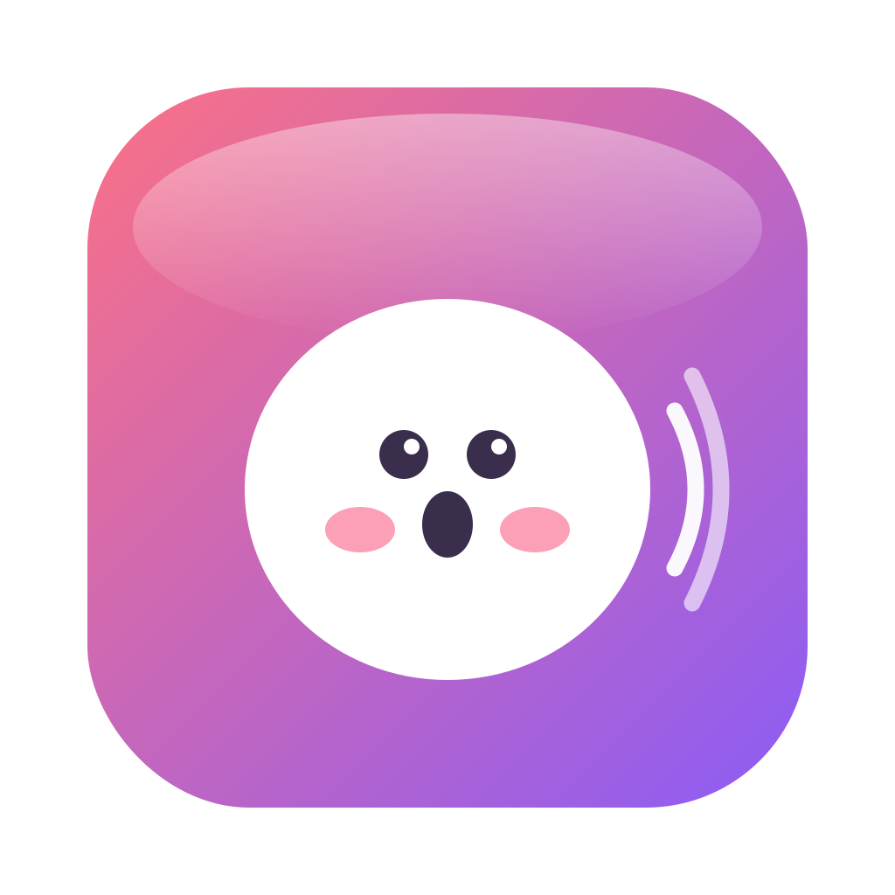

<div align="center">



# Murmo

**全地端語音助手 — 語音輸入 × 即時口譯字幕 × 會議紀錄 × 筆記問答**
**Your fully on-device voice assistant — dictation × live translated captions × meeting notes × notes Q&A**

零月租 · 無使用上限 · 隱私不外流 &nbsp;|&nbsp; No subscription · No usage caps · Privacy-first

`macOS 26+` · `Apple Silicon`

### 👉 [下載最新版 Murmo.dmg / Download](https://github.com/chung223/murmo-releases/releases/latest/download/Murmo.dmg)

</div>

---

## 🇹🇼 中文

Murmo 是一個**完全在本機執行**的 macOS 語音助手，取代 Typeless（語音輸入，有每月上限）與 Plaud／Granola（會議錄音＋翻譯＋紀錄）。辨識、潤飾、翻譯、摘要**全部在你的 Mac 上跑**（Apple Speech／WhisperKit ＋ 本地 Ollama LLM），不送雲端、零月租、無使用上限。

### ✨ 功能

| 模組 | 內容 |
|---|---|
| 🎙️ **語音輸入法** | 按住觸發鍵（可換）說話 → 插入游標；繁中／中英夾雜；潤飾、翻成英文、問 AI；toggle 長錄、邊講邊插入、逐 App 輸出模式；內建專業術語字典＋自訂熱詞；**會學你的寫作風格**（越用越像你） |
| 💬 **即時口譯字幕** | 攔系統聲音（免 BlackHole）或麥克風 → 螢幕下方浮動字幕；來源多語自動偵測，翻成 繁中／英／日／韓／泰／法／西；VAD 句界斷句；偵測 Zoom／Teams 自動開始 |
| 📝 **會議紀錄** | 自動錄音 → 結束生成 摘要／重點／待辦（可選會議型態模板）；**語者分離**（標誰說的）；匯出 SRT／互動 HTML 逐字稿；待辦接「提醒事項」、關聯行事曆事件 |
| 📚 **筆記 / Wiki** | 每次辨識存 Markdown；全文搜尋＋**本地語意向量搜尋**；「問我的筆記」RAG 問答 |
| ⬇️ **匯入轉錄** | 拖入音訊檔，或貼 **YouTube／Podcast 網址**（yt-dlp）→ 轉錄＋翻譯＋生成紀錄 |
| 📊 **總覽 / 歷史** | 字數、次數、省下打字時間統計與圖表；語音／會議／匯入分類歷史 |

### 📦 安裝
1. [**下載 Murmo.dmg**](https://github.com/chung223/murmo-releases/releases/latest/download/Murmo.dmg)
2. 打開 DMG，把 **Murmo** 拖進 `Applications`
3. ⚠️ **第一次打開請看下方 Gatekeeper 說明**
4. 安裝 [**Ollama**](https://ollama.com/download)
5. 開啟 Murmo → 走「**開始**」分頁：一鍵下載模型、開啟權限

> ### ⚠️ Gatekeeper（重要）
> Murmo 是**自簽**應用程式（非 App Store／未公證），第一次打開時 macOS 會擋下來說「**無法驗證開發者**／已損毀」。這是正常的，**只需做一次**：
>
> **在 Applications 裡對 Murmo 按右鍵 →「打開」→ 再按「打開」。**
>
> 若仍被擋，在終端機執行：
> ```bash
> xattr -dr com.apple.quarantine /Applications/Murmo.app
> ```

### 🔧 需求
- macOS 26 以上、Apple Silicon（M 系列）
- [Ollama](https://ollama.com) ＋ 模型約 8GB（精靈一鍵下載：`qwen2.5:7b`、`translategemma:4b`、`nomic-embed-text`）
- 選用：`brew install yt-dlp ffmpeg`（網址轉錄才需要）

### 🔒 隱私
所有辨識、潤飾、翻譯、摘要、問答都在**本機完成**，你的語音與會議內容不會離開這台 Mac。

---

## 🇬🇧 English

Murmo is a **fully on-device** macOS voice assistant that replaces Typeless (dictation, monthly-capped) and Plaud/Granola (meeting recording + translation + notes). Everything — recognition, polishing, translation, summarization — **runs locally** (Apple Speech / WhisperKit + local Ollama LLM). No cloud, no subscription, no usage limits.

### ✨ Features
- 🎙️ **Dictation** — push-to-talk (rebindable) → insert at cursor; Chinese/English mixed; polish, translate-to-English, ask-AI; toggle long-record, live insertion, per-app output; built-in tech glossary + custom terms; **learns your writing style**.
- 💬 **Live translated captions** — system audio (no BlackHole) or mic → floating subtitles; auto source detection → Traditional Chinese / English / Japanese / Korean / Thai / French / Spanish; VAD segmentation; auto-start on Zoom/Teams.
- 📝 **Meeting notes** — auto-record → summary / key points / action items (templates); **speaker diarization**; export SRT / interactive HTML; push to Reminders, link to Calendar.
- 📚 **Notes / Wiki** — Markdown; full-text **and local semantic search**; "ask my notes" RAG Q&A.
- ⬇️ **Import** — drop an audio file, or paste a **YouTube/Podcast URL** (yt-dlp) → transcribe + translate + notes.
- 📊 **Dashboard / History** — word counts, time saved, activity by type.

### 📦 Install
1. [**Download Murmo.dmg**](https://github.com/chung223/murmo-releases/releases/latest/download/Murmo.dmg)
2. Open the DMG, drag **Murmo** to `Applications`
3. ⚠️ **First launch — see Gatekeeper below**
4. Install [**Ollama**](https://ollama.com/download)
5. Open Murmo → the "**Setup**" tab: one-click model download + permissions

> ### ⚠️ Gatekeeper (important)
> Murmo is **self-signed** (not from the App Store / not notarized), so on first launch macOS blocks it ("**unidentified developer / damaged**"). Expected, **only needed once**:
>
> **Right-click Murmo in Applications → Open → Open.**
>
> If still blocked:
> ```bash
> xattr -dr com.apple.quarantine /Applications/Murmo.app
> ```

### 🔧 Requirements
macOS 26+ · Apple Silicon · [Ollama](https://ollama.com) (+ ~8GB models, downloaded by the wizard) · optional `brew install yt-dlp ffmpeg`

### 🔒 Privacy
All processing happens **locally**. Your voice and meetings never leave your Mac.

---

<div align="center">
<sub>Built with Swift, WhisperKit, Apple Speech & Ollama · 全地端 · Made for Apple Silicon</sub>
</div>
